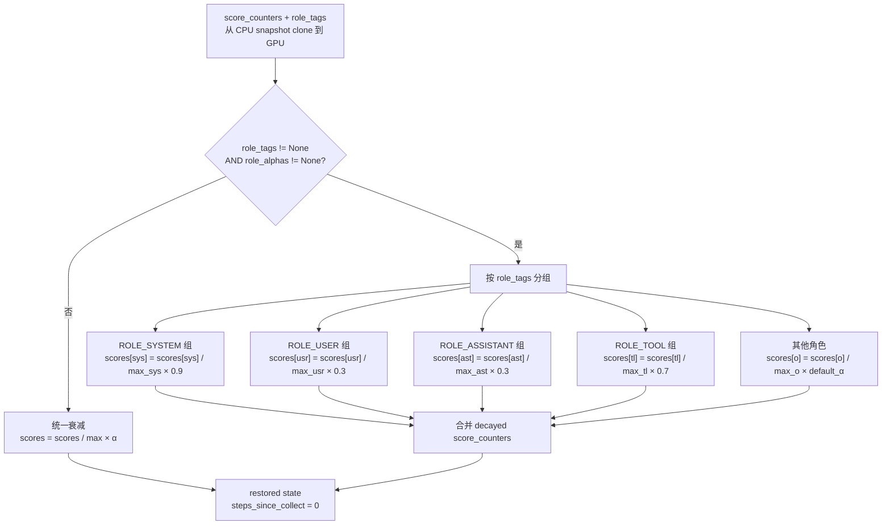

# baseline、streamingLLM、h2o 算法说明

本文档以当前代码实现为准，重点对应以下文件：

- `src/methods/baseline.py`
- `src/methods/streaming_llm.py`
- `src/methods/h2o.py`
- `src/api.py`
- `src/model.py`
- `src/chat_format.py`

## 1. 统一执行框架

三种方法共享同一套高层流程：

1. `normalize_sample(...)` 统一样本格式。
2. `LocalTransformerModel.format_prompt_ids(...)` 把 `prompt` 或 `messages` 转成 token ids。
3. `OracleKVProjectAPI._build_policy(...)` 根据方法和配置构建 policy。
4. 进入具体方法的生成路径。

当前三条主路径分别是：

- baseline：`OracleKVProjectAPI._generate_with_manual_cache`
- streamingLLM：`OracleKVProjectAPI._generate_with_streaming_cache`
- h2o：`OracleKVProjectAPI._generate_with_h2o`

这些路径共用的底层模型操作有：

- `prefill_next_token_logits(...)`
- `next_token_logits_from_cache(...)`
- `next_token_logits_from_cache_with_attention(...)`
- `prune_past_key_values(...)`
- `sample_next_token(...)`

需要特别说明的是：

- `prefill_next_token_logits_with_attention(...)` 在 eager 模式下用于 H2O prefill 阶段的注意力采集。
- `save_step_trace=True` 只会额外记录 `full_context_tokens`、`kept_tokens` 和 `kept_ratio`，不会改变实际裁剪逻辑。

## 2. baseline

### 2.1 算法定义

baseline 是 full-context 策略，不丢弃任何 token：

$$
\text{Keep}(t) = \{0, 1, 2, \dots, t-1\}
$$

### 2.2 当前实现

在 `src/api.py` 中，baseline 会直接把完整 `full_ids` 送入 `_generate_with_manual_cache(...)`：

1. 对完整 prompt 做一次普通 prefill
2. 获得下一 token 的 logits 和 `past_key_values`
3. 进入逐步 decode
4. 每一步都只在现有 cache 基础上追加，不做裁剪

### 2.3 特点

优点：

1. 最接近标准自回归解码。
2. 没有任何近似裁剪带来的信息损失。
3. 是最直接的对照基线。

代价：

1. KV cache 会随上下文持续增长。
2. 长上下文下显存与计算开销最大。

## 3. streamingLLM

### 3.1 算法定义

streamingLLM 只保留两类 token：

1. Sink Tokens：序列最前面的若干 token
2. Recent Tokens：序列末尾最近的若干 token

其缓存结构为：

$$
\text{KV Cache} = \text{Sink Tokens} + \text{Recent Tokens}
$$

预算为：

$$
\text{Budget} = \text{sink\_size} + \text{local\_window\_size}
$$

### 3.2 Prompt 阶段

当前实现会先调用 `prune_streaming_prompt(full_ids, policy)`，把完整 prompt 静态裁成：

- 前缀 `sink_size` 个 token
- 末尾 `local_window_size` 个 token

然后再对裁剪后的 `pruned_ids` 做 prefill。

### 3.3 Decode 阶段

生成过程中，`_generate_with_streaming_cache(...)` 会持续检查 budget：

1. 当前活动 cache token 数记为 `active_token_count`
2. 新 token 加入后的数量记为 `next_total = active_token_count + 1`
3. 当 `next_total > cache_budget + evict_period - 1` 时触发裁剪
4. 裁剪时保留：
   - 固定 sink 区间
   - 最新的 recent tail

因此：

- `evict_period = 1` 时，cache 会严格保持在预算内。
- `evict_period > 1` 时，cache 允许临时超预算最多 `evict_period - 1` 个 token，以减少裁剪频率。

### 3.4 特点

优点：

1. 实现简单。
2. cache 预算稳定且可解释。
3. 很适合作为“只靠 recency + sink”的对照方法。

限制：

1. 中间历史 token 会整体丢弃。
2. 无法保留那些虽不在 recent window 内、但长期重要的 token。

## 4. h2o

### 4.1 算法定义

h2o 在 streamingLLM 的基础上增加 Heavy Hitters：

1. Sink Tokens 必保留
2. Recent Tokens 必保留
3. 中间区域按累计分数选出 `heavy_hitter_size` 个高分 token

缓存结构可写为：

$$
\text{KV Cache} = \text{Sink Tokens} + \text{Heavy Hitters} + \text{Recent Tokens}
$$

预算为：

$$
\text{Budget} = \text{sink\_size} + \text{local\_window\_size} + \text{heavy\_hitter\_size}
$$

### 4.2 Score 计数器

h2o 的核心是活动 cache 中每个 token 都维护一个累计分数 $S_i$。

当 token 进入当前活动 cache 时：

$$
S_i = 0
$$

当某个 decode step 触发 attention 收集时，当前 query 对所有 key 的注意力会被聚合成一个向量 $s_{t,i}$，随后更新：

$$
S_i^{(t)} = S_i^{(t-1)} + s_{t,i}
$$

当前聚合方式来自 `LocalTransformerModel._aggregate_last_query_attention(...)`：

1. 取最后一个 query 对所有 key 的注意力行
2. 先在 head 维求平均
3. 再在有效 layer 维求平均

### 4.2.1 当前实现里的分数不是原始 qk，相当于什么

这里的 $s_{t,i}$ 不是 softmax 之前的原始 qk 相似度，也不是某个单层单头的分数。

当前实现真正累加的是：

1. 当前 decode 收集步里，最后一个 query token 对“当前活动 cache”全部 key token 的后 softmax 注意力概率。
2. 对所有有效 attention head 做平均。
3. 对所有有效 full-attention layer 做平均。
4. 把得到的长度为 `active_token_count` 的向量加到 `score_counters` 上。

写成公式，可记为：

$$
s_t(i) = \frac{1}{|L_t|} \sum_{l \in L_t} \frac{1}{H_l} \sum_{h=1}^{H_l}
\operatorname{softmax}\left(\frac{q_{l,h,t} K_{l,h,1:n}^{\top}}{\sqrt{d}} + m\right)_i
$$

其中：

1. $t$ 是当前 decode 收集步。
2. $i$ 是当前活动 cache 中的第 $i$ 个 token。
3. $L_t$ 是这一时刻真正返回 dense attention 的 layer 集合。
4. $H_l$ 是该 layer 的 query head 数。
5. $m$ 是 causal mask 与可能的 padding mask。

然后分数更新为：

$$
S_i \leftarrow S_i + s_t(i)
$$

因此当前 H2O 分数有四个重要性质：

1. 它是后 softmax 概率，不是 pre-softmax logits。
2. 它是最后一个 query 的回看分布，不是整段 prompt 的全局 attention 汇总。
3. 它是跨头平均、跨层平均后的结果，不保留单头差异。
4. 它是多次收集步上的累计量，不是单步静态打分。

### 4.2.2 在 Qwen3.5-9B 上具体来自哪些层、哪些头、哪些向量

当前默认模型 `local_models/Qwen3.5-9B` 是 hybrid 结构，不是 32 层都做 full attention。

根据模型配置：

1. 总层数是 32。
2. `layer_types` 里每 4 层出现一次 `full_attention`。
3. 因此当前 dense attention 分数只来自第 4、8、12、16、20、24、28、32 层。
4. `num_attention_heads = 16`。
5. `num_key_value_heads = 4`。
6. `head_dim = 256`。

这意味着当前分数不是“32 层全参与”的平均，而只是来自 8 个 full-attention 层的平均。

在每个 full-attention 层里，Qwen3.5 的向量来源是：

1. 当前层输入 `hidden_states` 先过 `input_layernorm`。
2. 用 `q_proj` 生成 query，再做 `q_norm`。
3. 用 `k_proj` 生成 key，再做 `k_norm`。
4. query 和 key 再一起应用 RoPE。
5. 如果存在 `past_key_values`，则把当前步的 key/value 追加到 cache 中。
6. 然后在 attention 内部计算最后一个 query 对全部 cache key 的注意力。

也就是说，当前分数依赖的是：

1. RoPE 之后的 query。
2. RoPE 之后、并且已经合入 cache 的 key。
3. 不直接依赖 value 向量本身。

需要特别注意 GQA：

1. Qwen3.5-9B 只有 4 个 KV heads，但有 16 个 query heads。
2. eager attention 内部会先把 KV heads repeat 到 query head 数。
3. 所以当前分数最终仍然是“16 个 query heads 的注意力分布平均”，只是这些 head 共享 4 组底层 KV 头。

### 4.2.3 当前代码到底取了哪一行 attention

`LocalTransformerModel._aggregate_last_query_attention(...)` 当前取的是：

1. batch 维固定取第 0 个样本。
2. head 维取所有 heads。
3. query 维固定取最后一个 query，也就是 `-1`。
4. key 维取当前活动 cache 中全部 key positions。

等价于对每层 attention 张量取：

$$
v_l = \text{mean}_{h}\left(A_l[0, h, -1, :]\right)
$$

然后再对 layer 做平均。

所以当前 H2O 分数并不是：

1. 所有 query 行的平均。
2. 整个 attention matrix 的总和。
3. 某个单头最强值。
4. 原始 qk logits。

### 4.2.4 这和几种近似分数的关系

如果后续改成更轻量的实现，可以把差异理解为下面几类。

第一类：在 attention 模块里直接导出最后一个 query 的压缩向量。

1. 如果导出的就是“当前层最后一个 query 的后 softmax 向量”，再按现在同样方式跨头、跨层聚合，那么语义上可以和当前实现等价。
2. 如果只导出 top-k、block sum 或别的压缩统计，就会从精确实现退化成近似实现。

第二类：自己拿 last-query 的 q 和历史 k 做轻量 qk 打分。

1. 如果拿到的是 attention 模块内部完全同一份 q、k，并且同样做 mask、缩放、softmax 和 GQA 头映射，那么也可以做到和当前实现等价。
2. 如果只算原始 qk 而不做 softmax，那么得到的是未归一化相似度，和当前“概率质量”分数不再同义。
3. 如果只取单层、单头，或提前做头合并，也会偏离当前实现。

第三类：自定义 kernel 或 patched attention，只返回 top-k、sum、running stats。

1. 如果 kernel 内部先算出与当前实现一致的最后一行 attention 分布，再直接返回聚合结果，本质上还是精确实现，只是 reduction 更早发生。
2. 如果只返回 top-k，通常会高估尖峰 token，低估那些长期稳定拿到中等注意力的 token。
3. 如果只返回块级统计，则会丢掉 token 级排序信息。

因此，和当前实现最接近的优化方向，不是“换一种新的分数定义”，而是“保留现有分数定义，把完整 attentions 的返回改成只返回最后一行或更早聚合后的结果”。

### 4.3 当前主执行路径

当前 `OracleKVProjectAPI._generate_with_h2o(...)` 的真实执行步骤是：

1. 对完整 prompt 调用 `prefill_next_token_logits(token_ids)`
2. 这一步不会请求 `output_attentions=True`
3. 用全零 `score_counters` 初始化当前活动 cache
4. 如果 prompt 已经超过预算，则立刻按当前零分计数器做一次初始裁剪
5. 进入逐步 decode
6. 每一步先采样下一个 token
7. 若“加入新 token 后”会超过 `budget + evict_period - 1`，则先裁剪旧 cache
8. 给新 token 追加一个零分计数器
9. 只有在以下任一条件满足时，才调用 `next_token_logits_from_cache_with_attention(...)`：
   - 本步需要裁剪
   - 自上次 attention 收集以来已经过了 `collect_period` 步

这意味着当前 h2o 是“decode-time online scoring”，不是“prompt-time full-attention scoring”。

### 4.4 首次裁剪为什么不是 prompt attention 驱动

这是当前实现最容易被旧文档写错的地方。

首次裁剪发生在：

1. prompt 已完成普通 prefill
2. `score_counters` 刚被初始化为全零
3. 代码调用 `policy.select_keep_tensor(active_token_count, score_counters)`

因为所有中间 token 的分数都相同，保留集合会退化为：

- sink tokens
- recent window
- 中间区里按照“更靠后优先”的极小 tie-break 选中的 token

所以当前实现里的第一次 H2O 裁剪，本质上更接近“零分初始化下的 recency 偏置”，而不是“full prompt attention 真实打分”。

### 4.5 Heavy Hitter 选择逻辑

在预算超限时，policy 会：

1. 保护 sink 区间
2. 保护 recent 区间
3. 在中间候选区中按累计分数选 `top-k`

当前 `src/methods/h2o.py` 的 tie-break 策略是：

- 如果分数相同，用一个极小的 recent 偏置把更靠后的 token 排在前面

因此 H2O 在“完全同分”场景下会偏向保留更新近的 token。

### 4.6 Attention 真正何时被读取

当前主路径不会在每一步都读取 attention。

只有满足以下条件时才会走带 attention 的增量前向：

1. 这一步需要裁剪
2. 或者 `steps_since_collect >= collect_period`

否则会直接走 `next_token_logits_from_cache(...)`，只拿 logits 和 cache，不拿 attention。

因此：

- `collect_period = 1` 最接近“每步都在线累计 attention”
- 更大的 `collect_period` 会减少 attention 调用次数，但分数更新也更稀疏

### 4.7 当前实现的作用域与边界

当前 H2O 分数只对“当前活动 cache 中仍然存活的 token”有效：

1. token 被驱逐后，其分数不会保留
2. 当前实现没有被驱逐 token 的召回
3. 当前实现也没有对被驱逐 token 做重算或回填

### 4.8 角色感知的跨轮衰减（Scheme C）

在多轮会话中，跨轮恢复时会根据每个 token 的消息角色执行差异化衰减。

#### 4.8.1 role_tags

`H2ORuntimeState` 现在维护一个与 `score_counters` 等长的 `role_tags` 张量（`torch.int8`），为每个 cache 位置标注角色：

| 常量 | 值 | 含义 |
|------|------|------|
| `ROLE_SYSTEM` | 0 | system 消息（系统提示、工具定义） |
| `ROLE_USER` | 1 | user 消息 |
| `ROLE_ASSISTANT` | 2 | 历史 assistant 消息 |
| `ROLE_TOOL` | 3 | tool 调用返回结果 |
| `ROLE_GENERATED` | 4 | 当前轮生成的 token |

`role_tags` 由 `build_token_role_ids()` 在 `src/chat_format.py` 中构造，通过增量前缀 tokenize 确保与实际 token 序列精确对齐。

`role_tags` 会在所有 state 操作中同步维护：

1. eviction 时按 `keep_tensor` 裁剪
2. 新 token 追加时标记为 `ROLE_GENERATED`
3. `trim_h2o_state_tail` 时同步截断
4. `clone_h2o_state` 时 clone 到目标设备

#### 4.8.2 角色感知衰减逻辑

`apply_role_aware_h2o_decay(score_counters, role_tags, role_alphas, default_alpha)` 的计算方式是：

对于每个角色 $r$ 及其对应的 $\alpha_r$，取该角色的所有分数做 max 归一化后乘以 $\alpha_r$：

$$
S_i^{\text{decayed}} = \frac{S_i}{\max_{j: \text{role}(j) = r} S_j} \times \alpha_r \quad \text{其中 } r = \text{role}(i)
$$

默认角色 alpha 值：

| 角色 | 默认 alpha | 含义 |
|------|-----------|------|
| system | 0.9 | 系统指令几乎不衰减，跨轮保留 |
| tool | 0.7 | 工具返回适度保留，有跨轮价值 |
| user | 0.3 | 快速衰减，让位给新轮内容 |
| assistant | 0.3 | 同上 |

当 `role_tags` 不可用或 `role_alphas` 未传入时，回退到旧版的统一 `apply_max_normalized_h2o_decay`。

可通过 `method_configs` 中的 `role_alpha_system`、`role_alpha_user`、`role_alpha_assistant`、`role_alpha_tool` 自定义各角色 alpha。

### 4.9 Attention 实现选择的实现细节

`api_server.py` 中，`--attn-implementation auto` 会解析成 `sdpa`。

这么做的原因是：

1. H2O 当前 prefill 不需要 attention 输出
2. 用 `sdpa` 可以避免长 prompt prefill 时物化巨大的 attention 矩阵
3. 当 decode 阶段某一步需要 `output_attentions=True` 时，query 只有 1 个 token，attention 张量远小于 full prefill 场景

如果你强制在长上下文上全程使用 `eager`，更容易在 prefill 阶段遇到 OOM。

## 5. 三种方法对比

### 5.1 保留策略

1. baseline：保留全部 token
2. streamingLLM：保留 sink + recent
3. h2o：保留 sink + heavy hitters + recent

### 5.2 Prompt 阶段差异

1. baseline：完整 prompt 直接 prefill
2. streamingLLM：先静态裁 prompt，再 prefill
3. h2o：完整 prompt 做 prefill 时同时采集最后一个 query 位置的注意力分数，首次裁剪由 prefill attention 驱动

### 5.3 Decode 阶段差异

1. baseline：无裁剪
2. streamingLLM：只按位置滑窗裁剪
3. h2o：按位置保护 + 累计分数选 heavy hitters

### 5.4 实现开销

1. baseline：实现最简单，但 cache 最大
2. streamingLLM：需要裁剪 cache，但不需要维护 attention 分数
3. h2o：需要维护 score 计数器，并在部分步上额外读取 attention

## 6. 当前实现边界

基于 `src/methods/*.py`、`src/api.py`、`src/model.py`、`src/chat_format.py` 的核对，当前边界如下：

1. streamingLLM 的 prompt 会在 prefill 前被静态裁剪；h2o 的 prompt 不会。
2. H2O 的首次 heavy-hitter 选择由 prefill 阶段采集的注意力分数驱动（Scheme D）。
3. H2O 的分数在 prefill 时初始化（最后一个 query 的注意力），在 decode 过程中持续在线累积。
4. `evict_period > 1` 时，cache 会临时超预算最多 `evict_period - 1` 个 token。
5. 当前实现没有被驱逐 token 的召回、重计算或重新注入。
6. 多轮会话中，跨轮恢复支持按角色差异化衰减（Scheme C），默认 system token 高保留、user/assistant token 快速衰减。
7. `role_tags` 会在所有 state 操作（eviction、clone、trim）中同步维护。
8. 直接通过 Python 调 `OracleKVProjectAPI.evaluate(...)` 时，默认 `collect_period=1`；通过 `api_server.py` CLI 启动服务时，默认 `--collect-period 0` 会被解析成"跟随 `evict_period`"。
9. H2O 多轮 session 复用不再强制依赖 `session_id`。当 client 未传 `session_id` 时，服务端会自动通过 token 前缀匹配在快照池中查找上一轮的 snapshot，对任何标准 OpenAI 兼容 client 透明生效。快照保存也是无条件执行。

## 7. H2O 多轮会话完整流程图

本节以流程图和配套说明的方式，完整描述当前 H2O 在 `POST /v1/chat/completions` 中的端到端行为，包括 session 命中条件、角色感知衰减、decode 循环和快照保存。

### 7.1 总体流程图

```mermaid
flowchart TD
    START(["POST /v1/chat/completions<br/>method=h2o"])
    START --> PARSE["解析请求参数<br/>score_alpha, role_alphas<br/>policy, signature"]
    PARSE --> TOKENIZE["format_prompt_ids → prompt_ids<br/>build_token_role_ids → role_ids"]
    TOKENIZE --> HAS_SID{"req.session_id<br/>存在?"}

    HAS_SID -- 是 --> LOOKUP_EXACT["LRU 精确查找<br/>get(session_id)"]
    HAS_SID -- 否 --> LOOKUP_PREFIX["LRU 自动前缀匹配<br/>find_by_prefix(prompt_ids, signature)"]
    LOOKUP_EXACT --> FOUND{"snapshot<br/>存在?"}
    LOOKUP_PREFIX --> FOUND
    FOUND -- 否 --> INIT
    FOUND -- 是 --> MATCH{"5 项匹配检查"}

    MATCH -- 不通过 --> INIT
    MATCH -- 通过 --> RESTORE["restore_h2o_state<br/>clone GPU + role-aware decay"]
    RESTORE --> CONTINUE["continue_h2o_state<br/>逐 token 处理追加部分"]
    CONTINUE --> GENERATE

    INIT["initialize_h2o_state<br/>prefill + SDPACapture 采集分数<br/>构造 role_tags<br/>若超预算: 首次裁剪"]
    INIT --> GENERATE

    GENERATE["generate_from_h2o_state<br/>自回归 decode 循环"]
    GENERATE --> DECODE_LOOP

    subgraph DECODE_LOOP ["Decode 循环 (每步)"]
        direction TB
        SAMPLE["sample_next_token<br/>采样下一个 token"]
        SAMPLE --> EOS{"遇到 EOS?"}
        EOS -- 是 --> LOOP_END(["退出循环"])
        EOS -- 否 --> ADVANCE["_advance_h2o_state_with_token"]
        ADVANCE --> CHECK_EVICT{"active+1 ><br/>budget+ep-1 ?"}
        CHECK_EVICT -- 是 --> DO_EVICT["select_keep_tensor 裁剪<br/>score_counters, role_tags, KV cache"]
        CHECK_EVICT -- 否 --> APPEND
        DO_EVICT --> APPEND["追加新 token<br/>score=0, role=GENERATED"]
        APPEND --> CHECK_COLLECT{"need_evict OR<br/>steps ≥ collect_period?"}
        CHECK_COLLECT -- 是 --> COLLECT["SDPACapture 采集注意力<br/>累加到 score_counters"]
        CHECK_COLLECT -- 否 --> SKIP["仅前向推理<br/>不采集注意力"]
        COLLECT --> NEXT_STEP(["→ 下一步"])
        SKIP --> NEXT_STEP
    end

    DECODE_LOOP --> SAVE_SNAP

    subgraph SAVE_SNAP ["Session 快照保存（无条件）"]
        direction TB
        GEN_KEY["生成 store_key<br/>session_id 或 auto_{hash}_{msg_count}"]
        GEN_KEY --> ALIGN["对齐 history_ids 与 generated_ids"]
        ALIGN --> ALIGN_CASE{"对齐方式"}
        ALIGN_CASE -- "history ⊇ gen" --> CLOSURE["continue 闭合 token"]
        ALIGN_CASE -- "gen ⊇ history" --> TRIM["trim 多余 token"]
        ALIGN_CASE -- "不匹配" --> SKIP_SAVE["跳过保存"]
        CLOSURE --> STORE["clone state → CPU<br/>存入 LRU"]
        TRIM --> STORE
        STORE --> RESP
        SKIP_SAVE --> RESP
    end

    RESP(["返回 ChatCompletion 响应"])
```



### 7.2 Session 查找策略

服务端支持两种 session 查找模式，对 client 完全透明：

**模式 1：显式 `session_id`（精确查找）**

当请求中携带 `session_id` 时，服务端直接通过 `LRUSessionStore.get(session_id)` 做 O(1) 精确查找。这是向后兼容路径，适用于 tau-bench 等能主动注入 session_id 的 agent 框架。

**模式 2：自动前缀匹配（无需 `session_id`）**

当请求中没有 `session_id` 时，服务端自动调用 `LRUSessionStore.find_by_prefix(prompt_ids, signature)` 在快照池中查找：

1. 取 `prompt_ids` 前 64 个 token 做 SHA-256 hash，在前缀索引中做 O(1) 候选查找
2. 对候选快照做完整的 `history_token_ids` 前缀比对
3. 选出最长匹配的快照（signature 必须一致）
4. 如果 hash 未命中，回退到遍历全部快照（O(N)，N = max_sessions）

这使得任何标准 OpenAI 兼容 client（MT-Bench、LangChain、OpenAI SDK 等）在多轮对话中都能自动复用上轮的 KV cache，无需任何适配。

**两种模式找到快照后，都需要通过以下 5 项匹配检查：**

| # | 条件 | 代码对应 | 含义 |
|---|------|----------|------|
| 1 | `snapshot.signature == signature` | sink_size、window_size、hh_size、evict_period、collect_period、alpha 全部一致 | 策略参数不能跨轮改变 |
| 2 | `snapshot.tools == active_tools` | 工具定义列表完全一致 | 工具变化会导致 system prompt 变化 |
| 3 | `len(messages) > len(snapshot.messages)` | 新请求消息条数严格大于快照 | 必须是追加而不是替换 |
| 4 | `messages[:len(snap.messages)] == snap.messages` | 前缀完全匹配 | 历史消息不能被修改 |
| 5 | `prompt_ids[:len(snap.history_token_ids)] == snap.history_token_ids` | token id 级别前缀一致 | 排除 tokenizer 差异或系统级变化 |

如果任一条件不满足，回退到 `initialize_h2o_state()` 全量重算。

**快照保存**

生成结束后，快照**无条件保存**（不再依赖 `session_id` 是否存在）：
- 有 `session_id`：用 `session_id` 作为存储 key
- 无 `session_id`：自动生成 key `auto_{hash}_{msg_count}`（基于 prompt 前缀 hash + 消息条数）

这保证了即使 client 从未传过 `session_id`，下一轮请求也能通过前缀匹配找到上轮快照。

### 7.3 跨轮衰减流程（Scheme C）

Session 命中后，`restore_h2o_state()` 会对 snapshot 中的 `score_counters` 执行衰减，流程如下：



**衰减的设计意图：**

- **system (α=0.9)**：系统指令和工具定义在整个会话生命周期里都重要，跨轮几乎不衰减。这保证了 system prompt 中的关键 token 在 eviction 竞争中长期占优。
- **tool (α=0.7)**：工具调用返回的事实性数据（如订单号、查询结果）在后续轮次仍可能被引用，适度保留。
- **user / assistant (α=0.3)**：上一轮的具体问答内容在新轮中通常不再是 attention 焦点，快速衰减让位给新轮 token。
- **default_α = session_score_alpha**：对 `role_alphas` 中未覆盖的角色（如 `ROLE_GENERATED`），使用请求指定的统一 alpha。

衰减后，只有追加的新 token（`appended_ids`）会通过 `continue_h2o_state()` 逐个走 `_advance_h2o_state_with_token()`，在线累积新的注意力分数。

### 7.4 Decode 循环详细说明

`generate_from_h2o_state()` 进入自回归循环，每步执行 `_advance_h2o_state_with_token()`：

**步骤 1：检查是否需要 eviction**

```
next_total = active_token_count + 1
need_evict = next_total > budget + evict_period - 1
```

当 `evict_period=1` 时，条件等价于 `next_total > budget`，即严格限制在预算内。`evict_period > 1` 时允许临时超预算。

**步骤 2：执行 eviction（如果需要）**

1. 将当前 `score_counters` 追加一个零分（为新 token 预留位置）
2. 调用 `policy.select_keep_tensor(next_total, extended_scores)` 确定保留集合
3. 保留集合由三部分组成：
   - **Sink 区**：前 `sink_size` 个位置（必保留）
   - **Local Window 区**：最后 `local_window_size` 个位置（必保留）
   - **Heavy Hitter 区**：中间区 `[sink_end, recent_start)` 中按累计分数 top-k 选出的 `heavy_hitter_size` 个位置
4. 过滤掉新 token 位置（`keep < active_token_count`），只裁剪旧 cache
5. 同步裁剪 `score_counters`、`role_tags`、`past_key_values`

**步骤 3：追加新 token**

- `score_counters` 追加 0
- `role_tags` 追加 `ROLE_GENERATED`
- `active_token_count += 1`
- `steps_since_collect += 1`

**步骤 4：决定是否采集注意力**

```
need_collect = need_evict or steps_since_collect >= collect_period
```

- 如果需要采集：通过 `SDPAAttentionCapture` wrapper 拦截 `F.scaled_dot_product_attention`，提取最后一个 query 对所有 key 的注意力分布（跨头平均、跨层平均），累加到 `score_counters`
- 如果不需要：仅调用 `next_token_logits_from_cache()` 做普通前向推理

### 7.5 快照保存流程

生成完成后，快照**无条件保存**（不再依赖 `session_id` 是否存在）：

1. 确定存储 key：
   - 有 `session_id` → 直接用 `session_id`
   - 无 `session_id` → 自动生成 `auto_{hash}_{msg_count}`（基于 prompt 前 64 token 的 hash + 消息条数）
2. 构造包含 assistant 回复的完整 `history_ids`
2. 将 `history_ids` 与 `generated_ids` 进行对齐，两种情况：

   | 情况 | 条件 | 处理 |
   |------|------|------|
   | history ⊇ generated | `history_suffix_ids` 前缀 = `generated_ids` | 通过 `continue_h2o_state()` 补走闭合 token（如 `<\|im_end\|>` 等标记） |
   | generated ⊇ history | `generated_ids` 前缀 = `history_suffix_ids` | 通过 `trim_h2o_state_tail()` 裁掉多余的尾部 |
   | 不匹配 | 两者前缀不一致 | 跳过保存 |

3. 对齐后，将 state clone 到 CPU 存入 `LRUSessionStore`（有界 LRU，默认 64 个 session）

### 7.6 角色标注的生命周期

`role_tags` 从构造到使用的完整生命周期：

```
build_token_role_ids()                     ← 初始构造（每个消息按角色打标）
       │
       ▼
initialize_h2o_state(role_ids=...)         ← 转为 torch.int8 tensor
       │
       ├─ eviction: role_tags[keep_tensor] ← 随 KV cache 同步裁剪
       ├─ advance:  cat(role_tags, [GENERATED]) ← 新 token 标记为 GENERATED
       ├─ trim:     role_tags[:keep_count]  ← 尾部截断时同步
       ├─ clone:    role_tags.to(device)    ← CPU↔GPU 搬运时同步
       │
       ▼
restore_h2o_state(role_alphas=...)         ← 跨轮衰减时按标签分组
       │
       ▼
continue_h2o_state(appended_ids)           ← 新 token 继续标记为 GENERATED
       │
       ▼
generate → advance → eviction ...          ← 循环中持续同步
       │
       ▼
clone_h2o_state("cpu") → LRU store         ← 快照保存
```

## 8. 参数建议

### baseline

baseline 没有算法级裁剪参数，主要受模型与采样参数控制。

### streamingLLM

重点参数：

1. `sink_size`
2. `local_window_size`
3. `evict_period`

经验上：

1. `sink_size` 保持较小即可。
2. `local_window_size` 决定近期上下文保留能力。
3. 增大 `evict_period` 会提升吞吐，但 budget 约束会更松。

### h2o

重点参数：

1. `sink_size`
2. `local_window_size`
3. `heavy_hitter_size`
4. `evict_period`
5. `collect_period`

经验上：

1. `heavy_hitter_size` 越大，越接近 baseline。
2. `heavy_hitter_size` 越小，越依赖 decode-time scoring 是否能稳定找出长期重要 token。
3. `collect_period = 1` 最接近“每步都在线更新”的 H2O。
4. 如果优先考虑吞吐，可以一起增大 `evict_period` 和 `collect_period`，但要接受分数更新更稀疏、cache 约束更松的代价。
5. 多轮会话中，`session_score_alpha` 作为 `default_alpha` 用于 `role_alphas` 中未覆盖角色的衰减。
6. `role_alpha_system`（默认 0.9）、`role_alpha_tool`（默认 0.7）等值可以按场景调整。有大量 system prompt 或 tool 调用的场景，建议保持 system/tool 较高的 alpha。